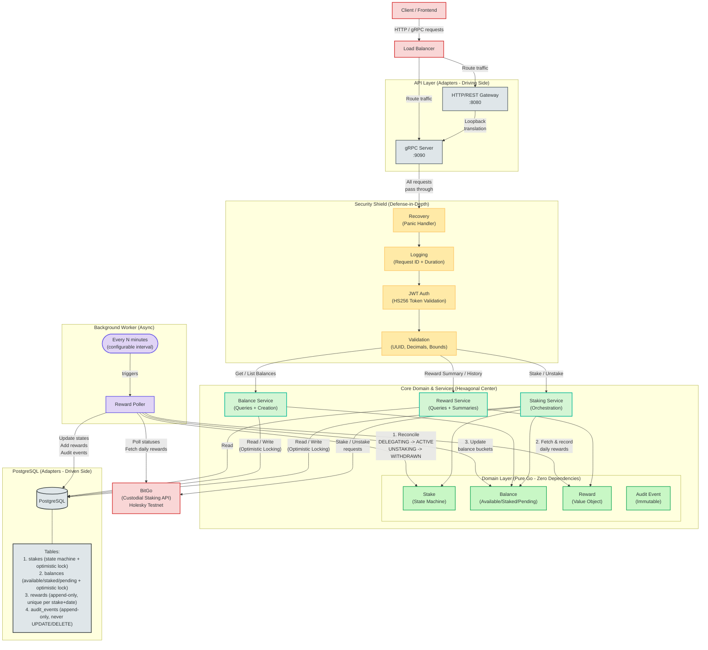

# Architecture Diagram

## Functional Requirements

- **Stake:** Users can stake ETH via BitGo.
- **Unstake:** Users can unstake and withdraw funds.
- **Track Balances:** The system tracks Available, Staked, and Pending balances.
- **Reconcile State:** A background worker automatically syncs stake statuses with the provider.
- **Process Rewards:** The system automatically fetches and records daily staking rewards.

**Out of scope:**
- Swap staked assets for other cryptocurrencies directly.
- Set up "Auto-Staking" for all incoming deposits.

## Non-Functional Requirements

- **Consistency >> Availability (Mutations):** For financial actions (staking, unstaking, balance updates), the system strictly prioritizes absolute consistency.
- **Availability >> Consistency (Reads & Async Ops):** For read operations (checking balances, viewing rewards) and third-party integrations, we prioritize availability.
- **Scalability (Stateless API & Background Workers):** Optimized for high-throughput fintech needs.
- **Security (Defense-in-Depth):** Even though this is a downstream microservice where authentication is assumed to be handled by the platform gateway, we practice defense-in-depth.
- **Idempotency:** Every state-changing network call requires an idempotency key, guaranteeing that background retries or frontend glitches will never duplicate a financial transaction.

**Out of scope:**
- "Social Media" Scale: We handle robust fintech throughput, but we aren't optimized for 100 million concurrent requests.
- Regional Compliance: GDPR and local data residency laws.
- Multi-Region CI/CD: Fully automated multi-region deployment pipelines.

---

## System Diagram

